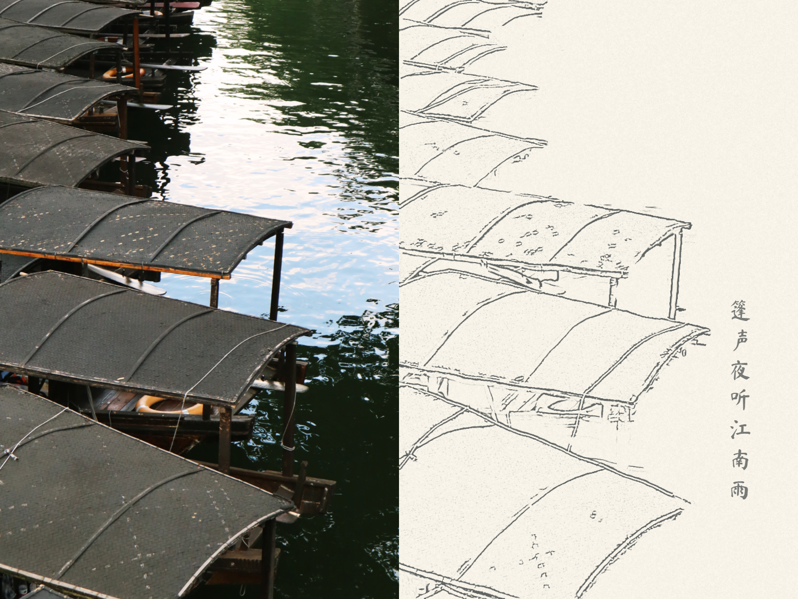

# 线稿明信片生成器 · Postcard Line Art Generator

出门旅行时，纪念品店的明信片大多只是直接打印的风景照。这个工具让你把自己拍的照片变成线稿明信片。配以留白和手写文字，更有记忆的温度:)

Most postcards in souvenir shops are just printed photos. This tool turns your own travel photos into line-art postcards — with white space and handwritten notes, they carry a warmer memory of the trip :)

**[在线体验 · Try it →](https://kiwizhong-1523.github.io/Postcard-Line-Art-Generator/)**

## 使用步骤 · How to Use

1. **选构图 · Compose** — 上传照片，拖动缩放，选择横版或竖版取景范围  
   Upload a photo, drag to pan and zoom, choose landscape or portrait framing.

2. **涂主体 · Mask** — 用画笔涂出想保留的区域，其余化为留白  
   Paint over the subject you want to keep; the rest becomes white space.

3. **调线稿 · Adjust** — 调整线条细腻度、粗细、笔触抖动，赋予手绘质感  
   Tune line detail, weight, and jitter to get a hand-drawn feel.

4. **加文字 · Add text** — 写上想写的内容，拖动定位，导出 PNG  
   Type your message, drag it into place, and export as PNG.

