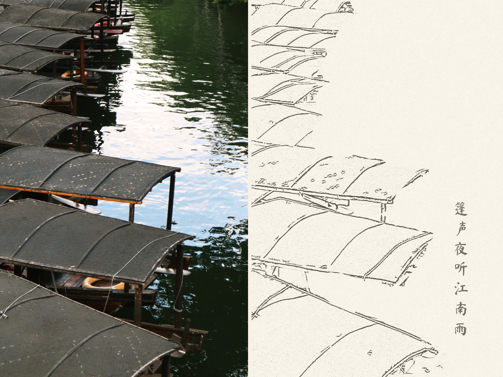
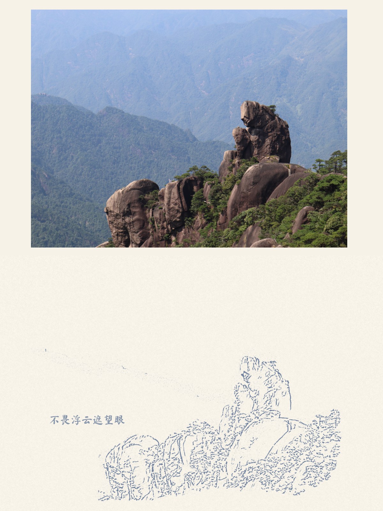

# 线稿明信片生成器

出门旅行时，纪念品店的明信片大多只是直接打印的风景照。这个工具让你把自己拍的照片变成线稿明信片。配以留白和手写文字，更有记忆的温度:)

**[在线体验 →](https://kiwizhong-1523.github.io/Postcard-Line-Art-Generator/)**

## 使用步骤

1. **选构图** — 上传照片，拖动缩放，选择横版或竖版取景范围
2. **涂主体** — 用画笔涂出想保留的区域，其余化为留白
3. **调线稿** — 调整线条细腻度、粗细、笔触抖动，赋予手绘质感
4. **加文字** — 写上想写的内容，拖动定位，导出 PNG

